Project: Forecasting Gas prices
================
May 13, 2021

``` r
library(pacman)
p_load(fpp3, tidyverse, readr, tidyr)
```

**Finding Data** The Energy Information Administration (EIA) is
responsible for the US Department of Energy’s statistics and data. There
is a wealth of data on crude oil and gasoline on the EIA’s website but
it can be tricky to access it. To help with this, the EIA created an API
for ease of access. I utilized the API at [eia
website](www.eia.com/opendata). The EIA releases new data weekly,
monthly, or annually depending on the different types of data. I
obtained code from the following website to download the JSON file and
saved the data as `eia_monthly_data.txt`.

[code for pulling
data](https://www.analyticsvidhya.com/blog/2021/01/use-r-to-pull-energy-data-from-the-department-of-energys-eia-api/)

``` r
# The Raw Data
eia_months <- read_csv("eia_months.csv")
eia_months <- eia_months %>% mutate(Date = yearmonth(Date)) 
tsibble(eia_months) %>% head(n=5)
```

    ## # A tsibble: 5 x 7 [1M]
    ##       Date `Unleaded Regula~ `Imported  Crude~ `Real Disposabl~ `Civilian Unemp~
    ##      <mth>             <dbl>             <dbl>            <dbl>            <dbl>
    ## 1 2010 Jan              2.73              91.2           11608.              9.8
    ## 2 2010 Feb              2.66              89.7           11606               9.8
    ## 3 2010 Mar              2.78              93.3           11644.              9.9
    ## 4 2010 Apr              2.86              97.3           11741               9.9
    ## 5 2010 May              2.87              86.5           11835.              9.6
    ## # ... with 2 more variables: Producer Price Index: Petroleum, Monthly <dbl>,
    ## #   Consumer Price Index (all urban consumers), Monthly <dbl>

``` r
tsibble(eia_months) %>% tail(n=5)
```

    ## # A tsibble: 5 x 7 [1M]
    ##       Date `Unleaded Regula~ `Imported  Crude~ `Real Disposabl~ `Civilian Unemp~
    ##      <mth>             <dbl>             <dbl>            <dbl>            <dbl>
    ## 1 2020 Nov              2.09              39.6           15351.             6.7 
    ## 2 2020 Dec              2.17              45.7           15386.             6.7 
    ## 3 2021 Jan              2.33              50.8           17078.             6.3 
    ## 4 2021 Feb              2.50              57.3           16267.             6.2 
    ## 5 2021 Mar              2.79              60.5           16578.             6.07
    ## # ... with 2 more variables: Producer Price Index: Petroleum, Monthly <dbl>,
    ## #   Consumer Price Index (all urban consumers), Monthly <dbl>

To make graphing easier I renamed the columns

``` r
eia_months <- tsibble(eia_months, index = "Date") %>% 
  rename(Unleaded = "Unleaded Regular Gasoline, U.S. City Average Retail Price, Monthly",
         Crude = "Imported  Crude Oil Real Price, Monthly",
         PDI = "Real Disposable Personal Income, Monthly",
         Unemp = "Civilian Unemployment Rate, Monthly" ,
         CPI = "Consumer Price Index (all urban consumers), Monthly") 
```

## 1 Regression

To do a forecast using regression I regressed The US average unleaded
gasoline price on the one month lag Crude oil price to forecast 12
months (from April 2020 to March 2021). I had to add more regressors and
after exploring the correlation plots and testing many models for the
highest adjusted R-squared and lowest AICc I selected `Crude_PDI_Season`
as the best model which regresses gas price on lag 1 crude oil price and
lag 1 disposable personal unemployment with a seasonal component of 1
year. The residuals looked good and the forecasts captured the movement
of the time series for the new data.

Here is the plot for the past 10 years of average price of unleaded
gasoline in US from the Energy Information Administration (EIA) .

``` r
eia_months %>% autoplot(Unleaded) + geom_line(color = "red") + 
  labs(x="", y = "Unleaded",
       title = "TIME PLOT OF U.S. GASOLINE PRICES, IN DOLLARS PER GALLON",
        subtitle = "(Jauary 2010 - March 2021)")
```

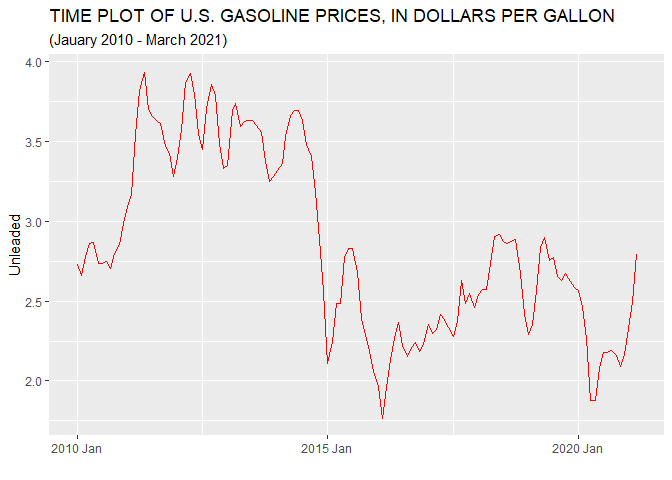<!-- -->

The average price of unleaded gas time series looks like a random walk.
The series shows a sharp drop in the level around Jan 2015, but does not
appear to have a strong seasonal pattern. The ACF shows a scalloped
shape as the correlations decay.

``` r
eia_months %>% ACF(Unleaded, lag_max= 36) %>%
  autoplot()
```

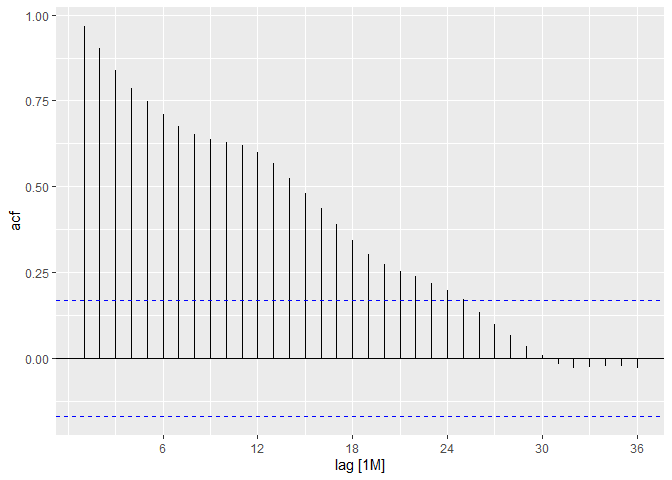<!-- -->
Look at a seasonal plot shows striking similarities for the same month
over 10 years. The blue line shows that the average price is higher in
the Spring/Summer months and lower in the Fall/Winter months.

``` r
eia_months %>% gg_subseries(Unleaded)
```

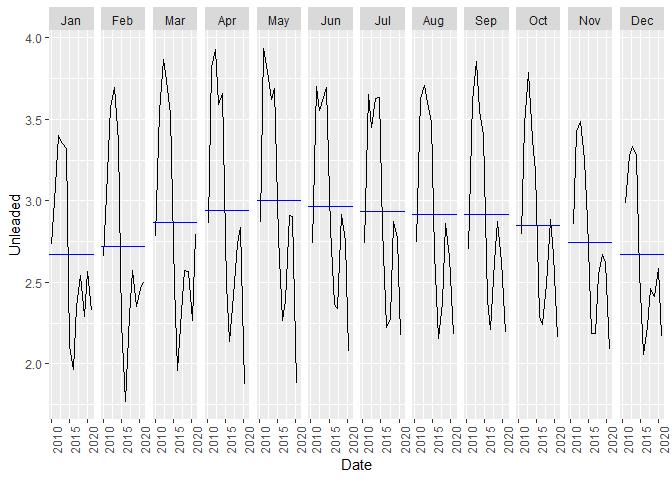<!-- -->

I chose to look at the lagged 1 month regressor of Crude price. I used
`mutate()` to include the lagged regressors by 1 month assuming a
forecast would use the previous months data which have a strong positive
correlation of 0.951. The prices have different ranges so I displayed
them separately.

``` r
eia_months_lag <- eia_months %>% 
  mutate(L1_Crude = lag(Crude, n = 1),
         L1_Unemp = lag(Unemp, n = 1),
         L1_PDI   = lag(PDI, n = 1),
         L1_CPI   = lag(CPI, n = 1))

eia_months_lag %>%  pivot_longer(c(Unleaded, L1_Crude), names_to ="Series") %>% 
  ggplot(aes(Date, value)) + geom_line() +
  facet_grid(vars(Series), scales = "free_y")
```

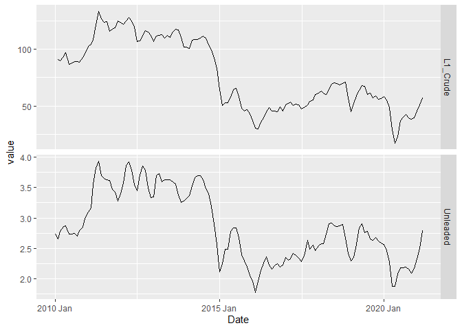<!-- -->

``` r
eia_months_lag %>% 
 GGally::ggpairs(columns = c(2, 8)) + 
  labs(title = "GASOLINE PRICES AGAINST LAGGED PRICE OF CRUDE OIL")
```

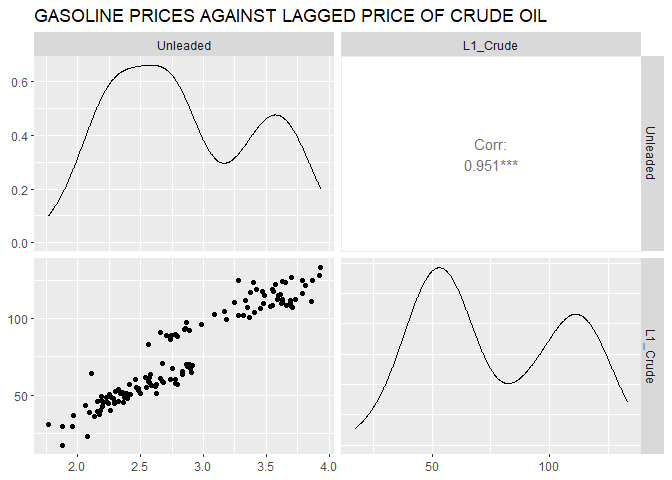<!-- -->

I fit a regression with`TSLM` using `L1_crude`, a superimposed time
series plots is given to show that it seems a good candidate for. The
first row contains missing values for the lagged variables so I did not
include it. The training set goes up to March 2020. The testing set is
from April 2020 to March 2021.

``` r
fit_Unleaded_1 <- eia_months_lag %>% select(Date,Unleaded, L1_Crude) %>% 
  filter(Date >= yearmonth("2010 Feb"), Date <= yearmonth("2020 March")) %>% 
  model(lm = TSLM(Unleaded ~ L1_Crude))

augment(fit_Unleaded_1) %>% 
  ggplot(aes(x = Date)) +
  geom_line(aes( y = Unleaded, color = "Data")) +
  geom_line(aes(y = .fitted, color = "Fitted")) +
  labs(y = NULL,
       title = "Average price of Unleaded in Dollars per Gallon") +
  scale_color_manual(values = c(Data="black", Fitted="#D55E00")) +
  guides(color = guide_legend(title = NULL))
```

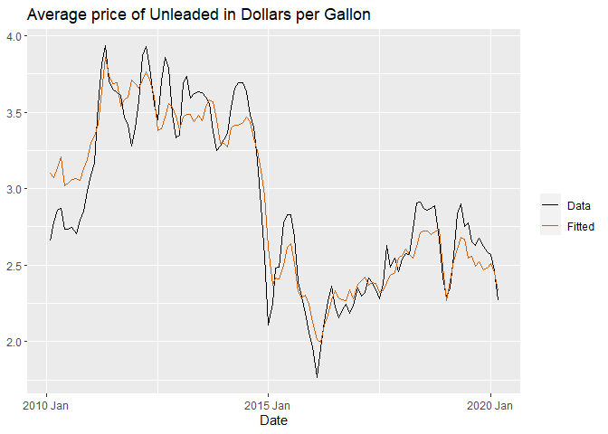<!-- -->

The residuals show an increasing trend and the ACF shows a significant
lag at period 12. The histogram is left skewed. To remedy this I tried
using more predictors. Adding more predictors from the other time series
I downloaded seems to help make recent years around January 2020 a
better fit. Next, I compared variety of models I thought would be
applicable. The best model selected was TSLM(Unleaded \~ L1\_Crude +
L1\_PDI + season(1 year)).

``` r
augment(fit_Unleaded_1) %>%
gg_tsdisplay(.resid, plot_type="hist")
```

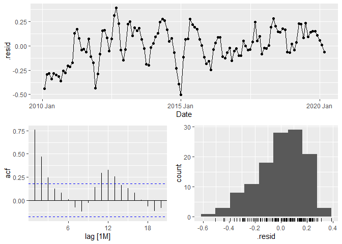<!-- -->

``` r
eia_months_lag %>% 
  select(Date, Unleaded, L1_Crude, L1_Unemp, L1_PDI, L1_CPI) %>% 
  filter(Date >= yearmonth("2010 Feb"), Date <= yearmonth("2020 March")) %>% 
  model(
    TSLM(Unleaded ~ L1_Crude + L1_Unemp + L1_PDI + L1_CPI)
    )%>% 
  augment() %>% 
  ggplot(aes(x = Date)) +
  geom_line(aes( y = Unleaded, color = "Data")) +
  geom_line(aes(y = .fitted, color = "Fitted")) +
  labs(y = NULL,
       title = "Average price of Unleaded in Dollars per Gallon") +
  scale_color_manual(values = c(Data="black", Fitted="#D55E00")) +
  guides(color = guide_legend(title = NULL))
```

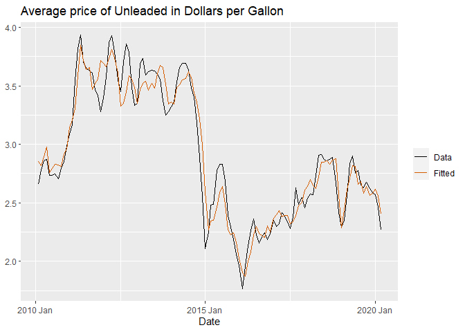<!-- -->

``` r
fit_eai_all <-  eia_months_lag %>% 
  select(Date, Unleaded, L1_Crude, L1_Unemp, L1_PDI, L1_CPI) %>% 
  filter(Date >= yearmonth("2010 Feb"), Date <= yearmonth("2020 March")) %>% 
  model(
    # Linear trend
    linear = TSLM(Unleaded ~ trend()),
    # Exponential trend
    exponential = TSLM(log(Unleaded) ~ trend()),
    # Piecewise linear trend
    piecewise = TSLM(Unleaded ~ trend(knots = c(2016, 2019))),
    trend_season =  TSLM(Unleaded ~ trend() + season()),
    Fit_simple_Crude = TSLM(Unleaded ~ L1_Crude), 
    Crude_and_Season = TSLM(Unleaded ~ L1_Crude + season()),
    fit_Crude_PDI_Lag1 =  TSLM(Unleaded ~ L1_Crude + L1_PDI),
    Crude_PDI_Season = TSLM(Unleaded ~ L1_Crude + L1_PDI + season(period = "1 year"))
    )
    
glance(fit_eai_all) %>% 
  select(.model, r_squared, adj_r_squared, AICc, CV) %>% 
  arrange(desc(adj_r_squared))
```

    ## # A tibble: 8 x 5
    ##   .model             r_squared adj_r_squared  AICc     CV
    ##   <chr>                  <dbl>         <dbl> <dbl>  <dbl>
    ## 1 Crude_PDI_Season       0.945         0.938 -462. 0.0218
    ## 2 fit_Crude_PDI_Lag1     0.921         0.920 -444. 0.0256
    ## 3 Crude_and_Season       0.917         0.908 -415. 0.0318
    ## 4 Fit_simple_Crude       0.894         0.893 -410. 0.0338
    ## 5 linear                 0.347         0.342 -189. 0.209 
    ## 6 piecewise              0.347         0.342 -189. 0.209 
    ## 7 exponential            0.332         0.327 -445. 0.0255
    ## 8 trend_season           0.391         0.324 -172. 0.236

Here are the plots of the time series selected for the best model
`Crude_PDI_Season`. To make the plots more readable,I only inlcuded
dates from 2015 onwards.

``` r
# Time series used for best model TSLM(Unleaded ~ L1_Crude + L1_PDI + season(1 year))
eia_months_lag %>% 
  filter(Date >= yearmonth("2015 Jan"), Date <= yearmonth("2020 March")) %>%      
  autoplot(vars(Unleaded, L1_Crude, L1_PDI))
```

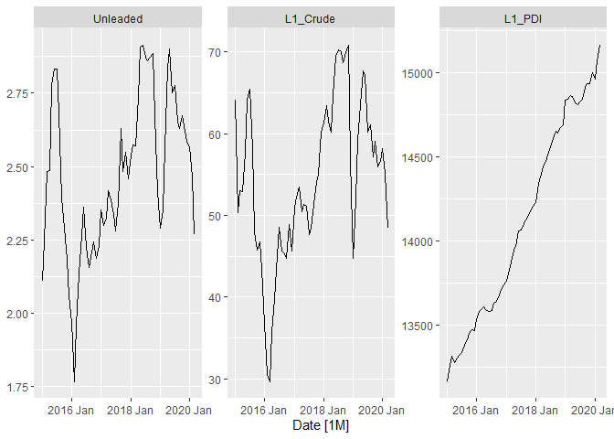<!-- -->

The equation of the best model is
$\\widehat{Unleaded} = -0.018 + 02145L1Crude + 0.00014L1PDI + season$.

The time plot of the residuals shows that the variation of the residuals
stays much the same across the data and therefore the residual variance
can be treated as constant. This can also be seen on the histogram of
the residuals. The histogram suggests that the residuals are normal.
Consequently, forecasts from this method will probably be quite good and
prediction intervals that are computed assuming a normal distribution
are accurate. Looks like residuals are normal and random error, they
appear to be white noise. The short term correlations are significant
however.

``` r
# fit_eai_all %>% select(Crude_PDI_Season) %>% report() 
fit_eai_all %>% select(Crude_PDI_Season) %>% 
  augment() %>%  gg_tsdisplay(.resid, "histogram") 
```

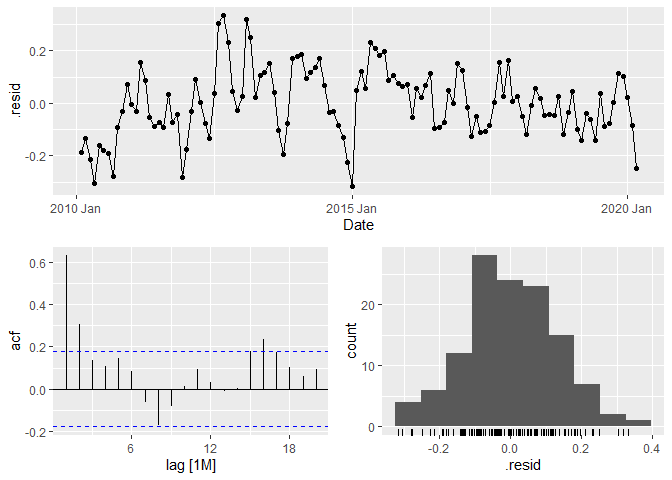<!-- -->

To make a forecast for 12 monthly periods I used data from April 2020 to
March 2021 to assess the accuracy of the forecast. L1\_Unemp, L1\_CPI

``` r
# April 2020 to March 2021
eai_1year <- eia_months_lag %>% 
    select(Date, Unleaded, L1_Crude, L1_PDI) %>% 
    filter(Date > yearmonth("2020 March"))

fit_unleaded_best <- fit_eai_all %>% select(Crude_PDI_Season) 

fc_unleaded_best <- fit_unleaded_best %>%  forecast(eai_1year)

# Plot the forecasts
eia_months_lag %>% filter(Date >= yearmonth("Jan 2015")) %>% 
  autoplot(Unleaded) +
  autolayer(fc_unleaded_best, level = NULL) +
   labs(y = "$US/Gallon",
       title = "US Monthly Average Gas Forecasted prices for 12 months",
       subtitle = "March 2020 to March 2021") 
```

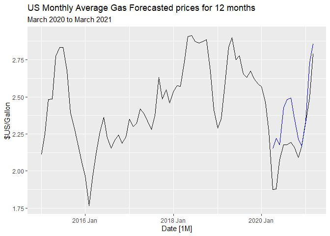<!-- -->

The prediction intervals are not too wide, but showing them on the plot
made it difficult to see the actual time-series values for unleaded for
comparison.

``` r
hilo(fc_unleaded_best) %>% unpack_hilo(c("80%", "95%")) %>% select(.model,Date, "80%_lower":"95%_upper")
```

    ## # A tsibble: 12 x 6 [1M]
    ## # Key:       .model [1]
    ##    .model               Date `80%_lower` `80%_upper` `95%_lower` `95%_upper`
    ##    <chr>               <mth>       <dbl>       <dbl>       <dbl>       <dbl>
    ##  1 Crude_PDI_Season 2020 Apr        1.96        2.34        1.86        2.44
    ##  2 Crude_PDI_Season 2020 May        2.02        2.42        1.92        2.52
    ##  3 Crude_PDI_Season 2020 Jun        1.98        2.37        1.88        2.47
    ##  4 Crude_PDI_Season 2020 Jul        2.23        2.62        2.13        2.72
    ##  5 Crude_PDI_Season 2020 Aug        2.29        2.68        2.19        2.78
    ##  6 Crude_PDI_Season 2020 Sep        2.30        2.68        2.20        2.78
    ##  7 Crude_PDI_Season 2020 Oct        2.16        2.55        2.06        2.65
    ##  8 Crude_PDI_Season 2020 Nov        2.03        2.41        1.93        2.51
    ##  9 Crude_PDI_Season 2020 Dec        1.98        2.36        1.88        2.46
    ## 10 Crude_PDI_Season 2021 Jan        2.15        2.53        2.05        2.63
    ## 11 Crude_PDI_Season 2021 Feb        2.53        2.93        2.42        3.04
    ## 12 Crude_PDI_Season 2021 Mar        2.66        3.05        2.56        3.16

``` r
accuracy(fc_unleaded_best, eai_1year ,
  measures = list(
    point_accuracy_measures,
    interval_accuracy_measures,
    distribution_accuracy_measures
  )
) %>% select(.model:MAPE)
```

    ## # A tibble: 1 x 7
    ##   .model           .type     ME  RMSE   MAE   MPE  MAPE
    ##   <chr>            <chr>  <dbl> <dbl> <dbl> <dbl> <dbl>
    ## 1 Crude_PDI_Season Test  -0.184 0.216 0.184 -8.68  8.68

## 2 Exponential Smoothing

For exponential smoothing I wanted to determine any trend and
seasonality components. Here I show the data again for US average
unleaded gas price with a superimposed trend fitted using the `STL()`
and LOESS method.

``` r
decomp_model <- eia_months_lag %>% select(Date, Unleaded) %>%
   filter(Date >= yearmonth("2010 Feb"), Date <= yearmonth("2020 March")) %>% 
  model(stl = STL(Unleaded)) %>% 
  components() %>% 
  select(-.model) 
 decomp_model %>% autoplot(Unleaded, color="gray") +
  geom_line(aes(y=trend), color = "#D55E00") +
  labs(y = "$ per Gallon",title = "Average Price of Unleaded Gas: US")
```

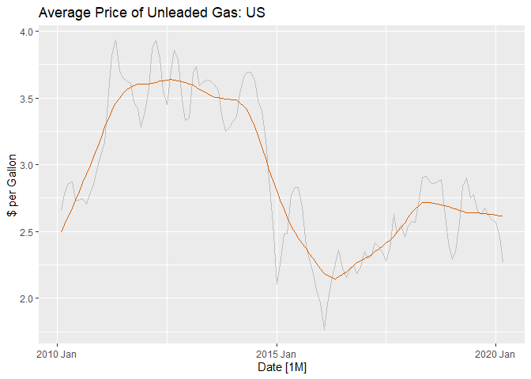<!-- -->

``` r
eia_months_lag %>% select(Date, Unleaded) %>%
   filter(Date >= yearmonth("2010 Feb"), Date <= yearmonth("2020 March")) %>% 
  model(stl = STL(Unleaded)) %>% components() %>% 
  autoplot() + labs(title = "ETS components")
```

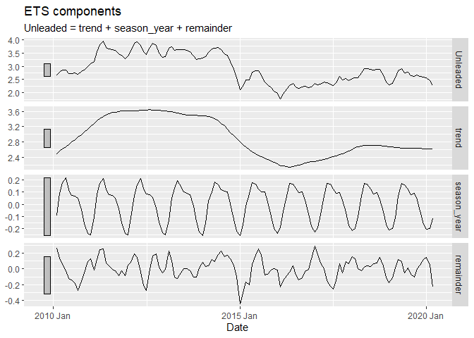<!-- -->

I used the `ETS()` function to select the model by minimizing the AICc.
The model selected is an Additive Errors model. I also tried some other
models I could think of but they were not helpful.

``` r
fit_Unleaded_2a <-  eia_months_lag %>% select(Date, Unleaded) %>%
   filter(Date >= yearmonth("2010 Feb"), Date <= yearmonth("2020 March")) %>%
  model(auto = ETS(Unleaded),
        additive = ETS(Unleaded ~ error("A") + trend("A") +
                                                season("A", period = 12)),
        multiplicative = ETS(Unleaded ~ error("M") + trend("A") +
                                                season("M", period = 12))
  )

fit_Unleaded_2a %>% pivot_longer(everything(), names_to = "Model name",
                       values_to = "Orders")
```

    ## # A mable: 3 x 2
    ## # Key:     Model name [3]
    ##   `Model name`         Orders
    ##   <chr>               <model>
    ## 1 auto           <ETS(A,N,N)>
    ## 2 additive       <ETS(A,A,A)>
    ## 3 multiplicative <ETS(M,A,M)>

``` r
glance(fit_Unleaded_2a) %>% arrange(AICc)
```

    ## # A tibble: 3 x 9
    ##   .model          sigma2 log_lik   AIC  AICc   BIC    MSE   AMSE    MAE
    ##   <chr>            <dbl>   <dbl> <dbl> <dbl> <dbl>  <dbl>  <dbl>  <dbl>
    ## 1 auto           0.0217    -58.3  123.  123.  131. 0.0213 0.0613 0.112 
    ## 2 additive       0.0230    -54.4  143.  149.  190. 0.0200 0.0518 0.115 
    ## 3 multiplicative 0.00426   -79.7  193.  199.  241. 0.0290 0.0500 0.0462

``` r
fit_Unleaded_2a %>% select(auto) %>%  report()
```

    ## Series: Unleaded 
    ## Model: ETS(A,N,N) 
    ##   Smoothing parameters:
    ##     alpha = 0.9999 
    ## 
    ##   Initial states:
    ##      l[0]
    ##  2.666004
    ## 
    ##   sigma^2:  0.0217
    ## 
    ##      AIC     AICc      BIC 
    ## 122.5927 122.7961 131.0048

``` r
fit_Unleaded_2a %>% select(auto) %>% gg_tsresiduals()
```

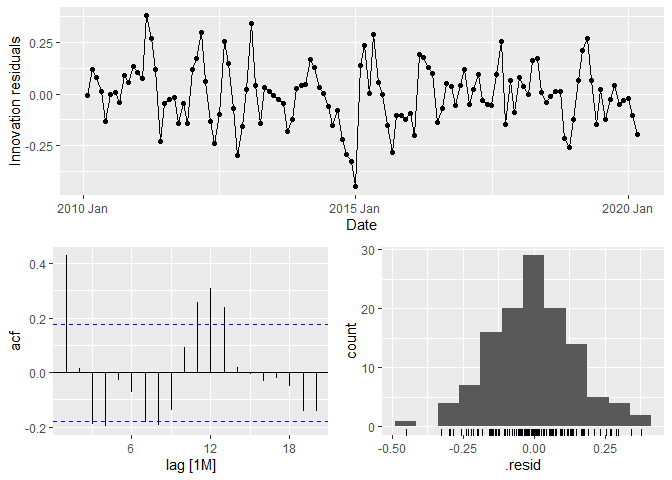<!-- -->

Forecasts 12 months ahead, from April 2020 to March 2021 showing the
past three years.

``` r
# forecast 12 months ahead  
fc_2a <- fit_Unleaded_2a %>% select(auto) %>% forecast(h = "1 year") 

fc_2a %>% 
  autoplot( eia_months_lag %>%  filter(Date > yearmonth("2020 Jan"))) 
```

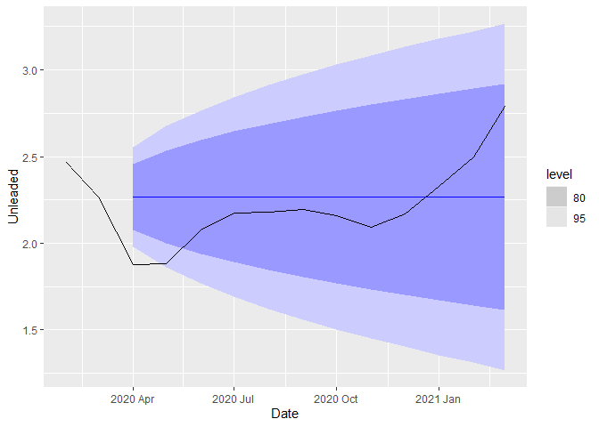<!-- -->

``` r
accuracy(fc_2a, eai_1year)
```

    ## # A tibble: 1 x 10
    ##   .model .type      ME  RMSE   MAE   MPE  MAPE  MASE RMSSE  ACF1
    ##   <chr>  <chr>   <dbl> <dbl> <dbl> <dbl> <dbl> <dbl> <dbl> <dbl>
    ## 1 auto   Test  -0.0664 0.249 0.202 -4.16  9.24   NaN   NaN 0.526

``` r
hilo(fc_2a) %>% unpack_hilo(c("80%", "95%")) %>% select(.model,Date, "80%_lower":"95%_upper")
```

    ## # A tsibble: 12 x 6 [1M]
    ## # Key:       .model [1]
    ##    .model     Date `80%_lower` `80%_upper` `95%_lower` `95%_upper`
    ##    <chr>     <mth>       <dbl>       <dbl>       <dbl>       <dbl>
    ##  1 auto   2020 Apr        2.08        2.46        1.98        2.56
    ##  2 auto   2020 May        2.00        2.53        1.86        2.68
    ##  3 auto   2020 Jun        1.94        2.59        1.77        2.77
    ##  4 auto   2020 Jul        1.89        2.64        1.69        2.84
    ##  5 auto   2020 Aug        1.85        2.69        1.62        2.91
    ##  6 auto   2020 Sep        1.80        2.73        1.56        2.97
    ##  7 auto   2020 Oct        1.77        2.77        1.50        3.03
    ##  8 auto   2020 Nov        1.73        2.80        1.45        3.08
    ##  9 auto   2020 Dec        1.70        2.83        1.40        3.13
    ## 10 auto   2021 Jan        1.67        2.86        1.35        3.18
    ## 11 auto   2021 Feb        1.64        2.89        1.31        3.22
    ## 12 auto   2021 Mar        1.61        2.92        1.27        3.27

## 3 ARIMA

From the ACF I could see the correlations are declining in a linear
fashion with some scallop shape around 12 months. Since the data are not
stationary I took the second difference and checked the differences look
like white noise.

``` r
eia_months_lag %>% select(Date, Unleaded) %>% 
  filter(Date > yearmonth("2010 Jan"),  Date <= yearmonth("2020 March")) %>% 
   gg_tsdisplay(Unleaded, plot_type = "partial")
```

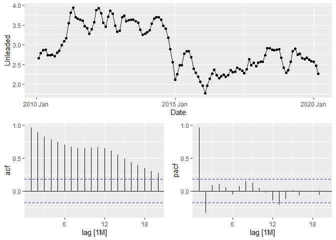<!-- -->

``` r
eia_months_lag %>% select(Date, Unleaded) %>%
  filter(Date > yearmonth("2010 Jan"), Date <= yearmonth("2020 March")) %>% 
gg_tsdisplay(difference(Unleaded, differences = 1), plot_type="partial", lag = 36)
```

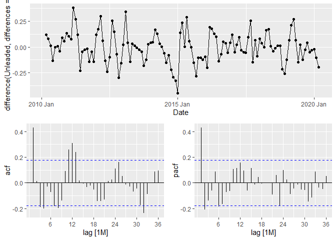<!-- -->

The first difference shows significant spikes at lag 4, 8, and 12
suggest a non-seasonal moving average, MA(4), component. The significant
spike at lag 12 in the ACF suggests a seasonal MA(1) component. This
gives us a starting point of an ARIMA(0,1,4)(0,1,1)\[12\] indicating a
first difference, a seasonal difference, a non-seasonal MA(1) component
and a seasonal MA(1) component. This guess from the ACF plots is close
to the one selected automatically ARIMA(0,1,4)(1,0,0)\[12\].

``` r
fit_3a <- eia_months_lag %>% select(Date, Unleaded) %>% 
  filter(Date > yearmonth("2010 Jan"), Date <= yearmonth("2020 March")) %>% 
  model(
    arima011011 = ARIMA(Unleaded ~ pdq(0,1,1) + PDQ(0,1,1)),
    auto = ARIMA(Unleaded, stepwise = FALSE, approx = FALSE)   # takes longer but more accurate
  )

fit_3a %>% pivot_longer(everything(), names_to = "Model name",
                       values_to = "Orders")
```

    ## # A mable: 2 x 2
    ## # Key:     Model name [2]
    ##   `Model name`                    Orders
    ##   <chr>                          <model>
    ## 1 arima011011  <ARIMA(0,1,1)(0,1,1)[12]>
    ## 2 auto         <ARIMA(0,1,4)(1,0,0)[12]>

``` r
glance(fit_3a) %>% arrange(AICc)
```

    ## # A tibble: 2 x 8
    ##   .model      sigma2 log_lik   AIC  AICc   BIC ar_roots   ma_roots  
    ##   <chr>        <dbl>   <dbl> <dbl> <dbl> <dbl> <list>     <list>    
    ## 1 auto        0.0160    80.6 -149. -149. -132. <cpl [12]> <cpl [4]> 
    ## 2 arima011011 0.0165    59.8 -114. -113. -106. <cpl [0]>  <cpl [13]>

``` r
fit_3a %>% select(.model = "auto" ) %>%  report()
```

    ## Series: Unleaded 
    ## Model: ARIMA(0,1,4)(1,0,0)[12] 
    ## 
    ## Coefficients:
    ##          ma1    ma2      ma3      ma4    sar1
    ##       0.4254  0.065  -0.1603  -0.2702  0.1699
    ## s.e.  0.0931  0.100   0.0992   0.0888  0.0947
    ## 
    ## sigma^2 estimated as 0.016:  log likelihood=80.62
    ## AIC=-149.24   AICc=-148.51   BIC=-132.47

The residuals for the best model are shown below. One small bust
significant spike at lag 32 is still consistent with white noise. To be
sure we use a Ljung-Box test, A large p-value confirms that the
residuals are similar to white noise.

``` r
fit_3a %>% select(auto) %>% gg_tsresiduals(lag=36)
```

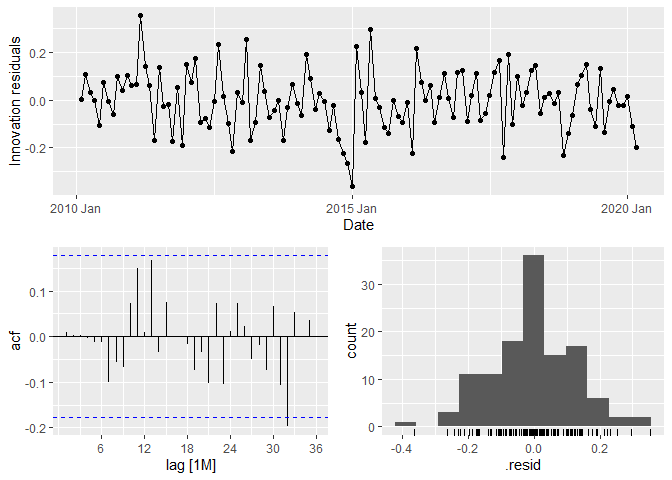<!-- -->

``` r
augment(fit_3a) %>%  filter(.model == "auto") %>% 
  features(.innov, ljung_box, lag = 32, dof = 4)
```

    ## # A tibble: 1 x 3
    ##   .model lb_stat lb_pvalue
    ##   <chr>    <dbl>     <dbl>
    ## 1 auto      27.8     0.476

This seasonal ARIMA model passes the required checks and is ready for
forecasting. A Forecast from the model for the next 12 months are shown.

``` r
forecast(fit_3a, h = 12) %>% 
  filter(.model =='auto') %>% 
  autoplot( eia_months_lag %>%  filter(Date > yearmonth("2018 Jan"))) +
  labs(title = "US unleaded average gas price",
       y = "Dollars per Gallon")
```

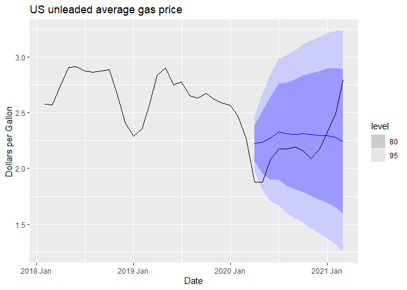<!-- -->
The 80% prediction interval does capture the future prices so I think
this is a good forecast.

#### Neural network autoregression

The `NNETAR()` function fits a model with seasonal data,
NNAR(2,1,2)<sub>12</sub> gives the 12 month lag for the first year, the
first 2 lags of Unleaded and 2 hidden networks.

``` r
Neural_fit <- eia_months_lag %>% select(Date, Unleaded) %>%
   filter(Date >= yearmonth("2010 Feb"), Date <= yearmonth("2020 March")) %>% 
  model(NNETAR(Unleaded)) 

Neural_fit %>% report()
```

    ## Series: Unleaded 
    ## Model: NNAR(2,1,2)[12] 
    ## 
    ## Average of 20 networks, each of which is
    ## a 3-2-1 network with 11 weights
    ## options were - linear output units 
    ## 
    ## sigma^2 estimated as 0.01335

A 12 month forecast is plotted which is capturing the upward trend but
with some dampening.

``` r
fc_Neural <- Neural_fit %>%   forecast(h = 12) 
fc_Neural %>% 
  autoplot( eia_months_lag %>%  filter(Date >    yearmonth("2018 Jan")))
```

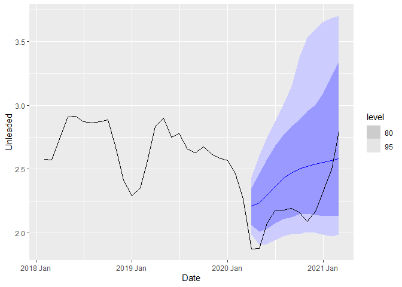<!-- -->

``` r
accuracy(fc_Neural, eai_1year ,
  measures = list(
    point_accuracy_measures,
    interval_accuracy_measures,
    distribution_accuracy_measures
  )
)
```

    ## # A tibble: 1 x 13
    ##   .model          .type     ME  RMSE   MAE   MPE  MAPE  MASE RMSSE  ACF1 winkler
    ##   <chr>           <chr>  <dbl> <dbl> <dbl> <dbl> <dbl> <dbl> <dbl> <dbl>   <dbl>
    ## 1 NNETAR(Unleade~ Test  -0.237 0.288 0.272 -11.5  12.8   NaN   NaN 0.420    1.68
    ## # ... with 2 more variables: percentile <dbl>, CRPS <dbl>
